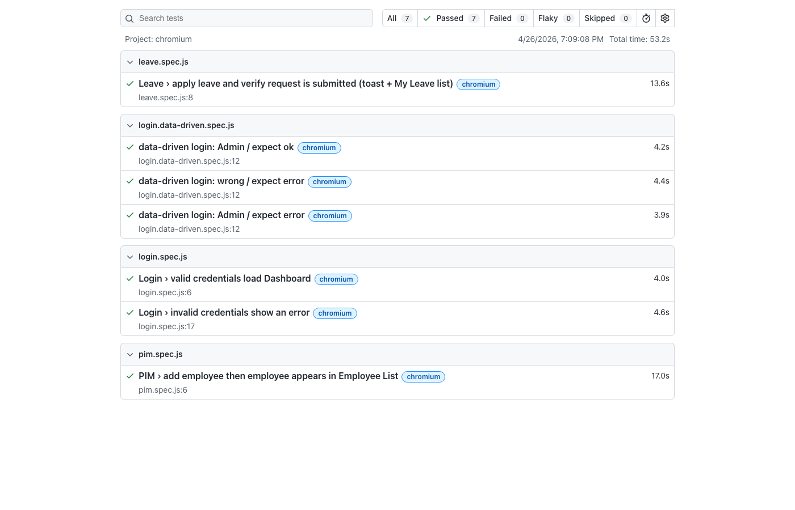

# OrangeHRM — Playwright E2E (Page Object Model)

End-to-end automation for the [OrangeHRM public demo](https://opensource-demo.orangehrmlive.com): login (valid/invalid, data-driven), PIM (add employee + list), and Leave (entitlement + apply + submission toast).

## Tech stack

| Area | Technology |
|------|------------|
| Runtime | Node.js (ES modules) |
| Test runner & browser automation | [@playwright/test](https://playwright.dev) |
| Pattern | Page Object Model — locators and actions in `pages/`, flows in `tests/` |
| Data-driven case | `test-data/loginData.json` + `tests/login.data-driven.spec.js` |
| Reporting | Playwright **HTML** reporter (output: `playwright-report/`) |
| CI | GitHub Actions — see `.github/workflows/playwright.yml` (artifact: `playwright-report`) |

## Project layout

- `pages/` — page objects (Login, Dashboard, PIM, Leave, Entitlement, Top bar)
- `tests/` — specs (`login.spec.js`, `login.data-driven.spec.js`, `pim.spec.js`, `leave.spec.js`)
- `test-data/` — shared test data (e.g. login credentials for data-driven tests)
- `playwright.config.js` — `baseURL`, timeouts, projects (Chromium, Firefox, WebKit), HTML reporter
- `docs/` — manual test cases, sample bug report, test report screenshot for submissions

## Prerequisites

- **Node.js** 18+ (LTS recommended)
- Network access to the demo URL (or your own instance via `BASE_URL`)

## Setup

1. **Clone the repository** (use your own fork or a repo under your [personal GitHub](docs/personal-github.md) account).

2. **Install dependencies**

   ```bash
   npm ci
   ```

3. **Install Playwright browsers**

   ```bash
   npx playwright install
   ```

4. **Optional: environment** — copy `.env.example` to `.env` and adjust if you do not use the public demo (see [Configuration](#configuration)).

## Configuration

- Default application URL: `https://opensource-demo.orangehrmlive.com` (set in `playwright.config.js`).
- Override with: `export BASE_URL=https://your-instance.example.com` (or add `BASE_URL=...` in `.env` and load it in your shell before `npm test`).
- Optional credentials in `.env` are for documentation only unless your code references them; the demo often uses the standard admin account documented on the OrangeHRM demo page.

## Run tests

| Command | Description |
|---------|-------------|
| `npm test` | All projects (Chromium, Firefox, WebKit) |
| `npm run test:chromium` | Chromium only (faster for local runs) |
| `npm run test:headed` | All tests with visible browser |
| `npm run test:ui` | Playwright UI mode |

## HTML test report

After a run, Playwright writes an HTML report to `playwright-report/` (this folder is gitignored).

**View the report locally:**

```bash
npm run report
```

This runs `playwright show-report` and opens the last generated HTML report in the browser.

A **captured example** of the report UI is stored in the repo for assignment README requirements:



*If you refresh the image after a new run, regenerate it from `playwright-report/index.html` or retake a screenshot of `npm run report` and overwrite `docs/test-report.png`.*

## CI

On push/PR to `main` or `master`, the workflow installs browsers, runs `npx playwright test`, and uploads the **playwright-report** folder as a workflow artifact (see Actions tab on GitHub).

## Personal GitHub

To host this project on your **personal** GitHub account: follow [docs/personal-github.md](docs/personal-github.md).


## License

See `package.json` (ISC).
